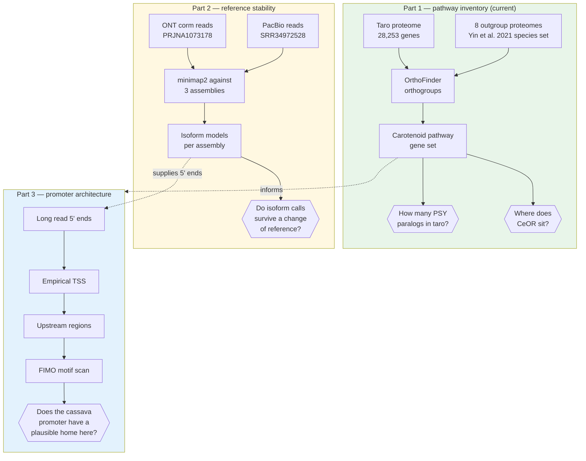

# taro

Long-read re-annotation of the carotenoid biosynthesis pathway in taro
(*Colocasia esculenta*).

This repository supports a collaboration on biofortification of Indonesian
taro landraces, where the plan is to raise beta-carotene content using the
MePSY1 promoter and gene from cassava. Before any construct is designed, it
is worth knowing what taro's own carotenoid genes look like, and whether the
published annotation describing them can be trusted.

## The question

Taro has three published genome assemblies of very different quality. The
same transcript data mapped against different assemblies may produce
different gene models. So:

> How much of taro's transcript level annotation reflects biology, and how
> much is an artifact of which reference assembly the reads were mapped to?

There is already a concrete reason to ask. Two published taro annotations
disagree about the number of protein coding genes by roughly a factor of two
(56,238 versus 28,253). See `LOGBOOK.md` for the details.

## Workflow



Parts 1 and 3 need only the genome, so they survive even if the public long
read data turns out too shallow to resolve Part 2. If Part 2 comes back
empty, that is itself a usable result: a quantitative statement of how much
sequencing depth the question would actually require.

## Why Part 1 comes first

It cannot fail. Orthology on a proteome with 96.9 percent BUSCO completeness
will produce an answer regardless of how the rest goes. It needs one proteome
plus a set of outgroups, not seven gigabytes of assemblies. And it answers the
question that most affects the collaborator's construct design.

That question is whether taro carries one phytoene synthase gene or several.
Cassava has two (PSY1 and PSY2) with different roles, and saffron has four.
If taro also has several, then "add a cassava PSY" means something different
from what the current plan assumes, because the endogenous paralogs may
already differ in where and when they are expressed.

## Repository layout

Code and data are kept apart. This repository holds everything that is small,
text based, and worth version controlling. The large files live on a separate
drive and are never committed, because they are all either downloadable from
public archives or reproducible by running the scripts here.

~/Code/taro/ this repository
├── envs/
│ ├── taro.yml conda environment specification
│ └── activate.sh sets paths, TMPDIR, thread count
├── scripts/ numbered pipeline steps
├── notebooks/ exploration and figure generation
├── docs/ data sources, analysis plan, questions
├── results/ tables and figures (the output)
├── LOGBOOK.md what was done, when, and why
└── store -> /mnt/f/RA/Downstream/Project5_TARO

/mnt/f/RA/Downstream/Project5_TARO/ large files, not tracked
├── refs/ assemblies, annotations, proteomes
├── data/ downloaded sequencing reads
├── work/ intermediates, one directory per analysis step
└── logs/ run logs


`store` is a symlink that git ignores. It lets you reach the data side from
inside the repository without the data ever entering version control.

## Setup

```bash
conda env create -f envs/taro.yml      # once
source envs/activate.sh                # at the start of every session
```

`activate.sh` sets four things you will see referenced throughout the scripts:

| Variable | Points to |
|---|---|
| `TARO_REFS` | reference sequences |
| `TARO_DATA` | downloaded reads |
| `TARO_WORK` | analysis intermediates |
| `TARO_LOGS` | run logs |

It also pins `TMPDIR` to a scratch directory inside the repository. This
matters because `/tmp` on this machine is a RAM backed filesystem (tmpfs) with
45 GB. A large sort writing there would consume memory rather than disk and
fail in a way that is confusing to diagnose.

## Scripts

Run in order. Each one writes to its own directory under `work/` and logs to
`logs/`.

| Script | Does |
|---|---|
| `01_fetch_taro.sh` | taro proteome and GFF3 from Figshare |
| `02_primary_isoform.sh` | collapse 34,340 transcripts to 28,253 genes |
| `03_probe_outgroups.sh` | check which Araceae proteomes NCBI holds |
| `04_probe_yin_set.sh` | check the Yin et al. 2021 substitute species set |
| `05_fetch_outgroups.sh` | first attempt, superseded by 06 |
| `06_rebuild_primary.sh` | outgroup proteomes, one protein per gene |
| `07_orthofinder.sh` | orthogroups across all nine species |

## Status

- [x] environment and repository layout
- [x] taro proteome, 28,253 genes, verified against the published count
- [x] outgroup proteomes, 9 species including cassava, gene counts verified
- [x] OrthoFinder run
- [x] carotenoid pathway inventory by reciprocal best hit
- [x] gene trees for PSY and the CCD/NCED family
- [ ] PSY copy number per species verified from tree topology
- [ ] figures
- [ ] Parts 2 and 3

## Preliminary findings

Public data only, Part 1 complete except for one verification step.

**Taro has one full-length phytoene synthase**, Ces24605 on Superscaffold13,
428 aa, 78% identity to Arabidopsis PSY and a reciprocal best hit. A second
PSY-like locus on Superscaffold7 is split across two gene models
(Ces12496 and Ces12497, 259 bp apart on the same strand) and recovers only
61% of a full-length protein even when combined. Whether it is a real second
copy or a degenerate locus cannot be decided from the published annotation,
which is itself the kind of problem this project set out to document.

**Taro has three CCD4 carotenoid cleavage dioxygenases**, Ces13251, Ces13250
and Ces03723, confirmed by gene tree against Arabidopsis anchors for both CCD4
and NCED3. CCD4 degrades carotenoids; in potato and peach it is a principal
determinant of flesh colour.

**Taro has both ORANGE chaperones**, Ces06664 and Ces26954, which control
phytoene synthase protein stability post-translationally.

Taken together: one synthesis gene, three degradation genes. Raising flux
through a single PSY may not produce the expected accumulation if the
degradation step is amplified. This is relevant to construct design and was
not anticipated when the project began.

**Two taro annotations disagree about gene count by roughly twofold**
(56,238 versus 28,253), which supports the premise motivating Parts 2 and 3.


## Data and permissions

Every input is public. Nothing in this pilot uses Indonesian plant material or
Indonesian derived data, so no material transfer agreement and no BRIN foreign
research permit is engaged at this stage. That changes as soon as landrace
material enters the project, and it should be raised before that happens
rather than after.

Accession records are mirrored in a companion repository, `seqfetch`, under
its `reference/`, `nanopore/` and `pacbio/` modules.

## Reading

Key references are listed with full context in `docs/data_sources.md`. The
three taro assemblies, the two long read datasets, and the reasoning behind
the outgroup species choice are all documented there.
