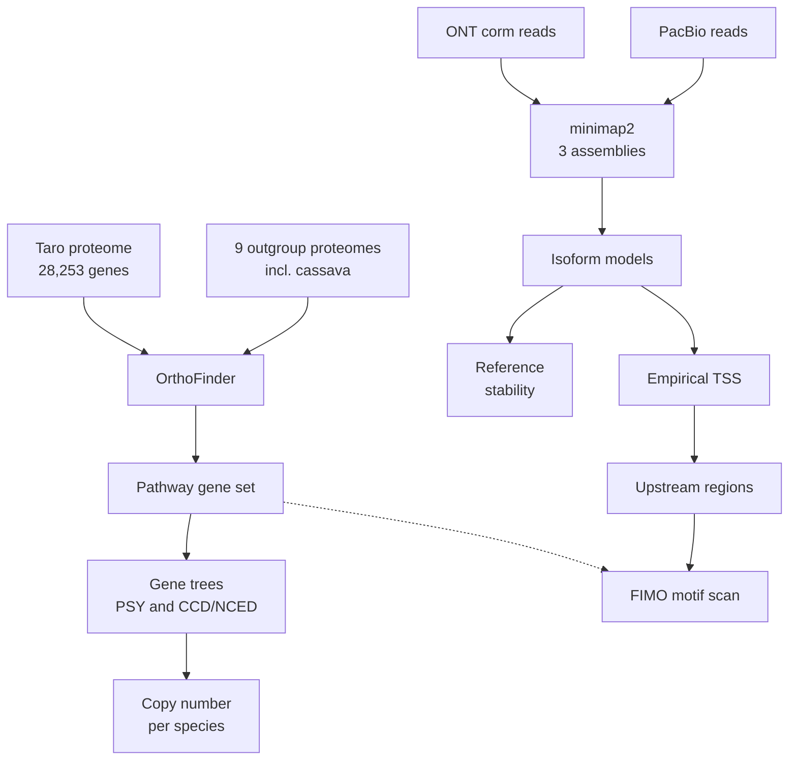

# taro

Carotenoid biosynthesis pathway in taro (*Colocasia esculenta*): gene
inventory, copy number, and the reliability of the published annotation.

This repository supports a collaboration on biofortification of Indonesian
taro landraces, where the plan is to raise beta-carotene content using the
MePSY1 promoter and gene from cassava. Before a construct is designed, it is
worth knowing what taro's own carotenoid genes look like, and whether the
annotation describing them can be trusted.

## The question

Taro has three published genome assemblies of very different quality, and the
same transcript data mapped against different assemblies can produce different
gene models. So:

> How much of taro's transcript level annotation reflects biology, and how much
> is an artifact of which reference assembly the reads were mapped to?

There is already a concrete reason to ask. Two published taro annotations
disagree about the number of protein coding genes by roughly a factor of two,
56,238 against 28,253.

## Workflow



**Part 1** inventories the pathway and counts copies. **Part 2** asks whether
transcript models survive a change of reference assembly. **Part 3** locates
where taro's own carotenogenic genes start transcribing, and whether the
cassava promoter has a plausible home there.

Parts 1 and 3 need only the genome, so they survive even if the public long
read data proves too shallow for Part 2. If Part 2 comes back empty, that is
itself a usable result: a quantitative statement of the sequencing depth the
question would require.

## Why Part 1 came first

It could not fail. Orthology on a proteome with 96.9% BUSCO completeness
produces an answer regardless of how the rest goes, and it needs one proteome
plus outgroups rather than seven gigabytes of assemblies.

It also answers the question that most affects construct design: how many
phytoene synthase genes taro carries. If taro had several, then "add a cassava
PSY" would mean something different from what the plan assumes, because
endogenous paralogs may already differ in where and when they are expressed.

## Findings so far

Part 1 is complete except for one verification step. Everything below comes
from public data.

**Taro has one full-length phytoene synthase.** Ces24605 on Superscaffold13,
428 aa against the 437 aa Arabidopsis reference, 78% identity, reciprocal best
hit. A second PSY-like locus on Superscaffold7 is split across two gene models,
Ces12496 and Ces12497, lying 259 bp apart on the same strand with nothing
annotated between them. Combined they recover only 61% of a full length
protein. Whether this is a real second copy or a degenerate locus cannot be
decided from the published annotation, which is itself an instance of the
problem this project set out to document.

**Taro has three CCD4 carotenoid cleavage dioxygenases.** Ces13251, Ces13250
and Ces03723, confirmed by gene tree against Arabidopsis anchors for both CCD4
and NCED3, with every gene roughly twice as far from the wrong anchor as from
the right one. CCD4 degrades carotenoids, and in potato and peach CCD4
variation is a principal determinant of flesh colour.

**Taro has both ORANGE chaperones.** Ces06664 and Ces26954, which control
phytoene synthase stability post-translationally. This matters because OR acts
on PSY protein, not PSY transcript, so transcript level engineering does not
address it.

Taken together: one synthesis gene against three degradation genes. Raising
flux through a single PSY may not produce the expected accumulation if the
degradation step is amplified. This bears directly on construct design and was
not anticipated when the project began.

**Still to verify.** Per-species PSY copy number is currently taken from
homology search hit counts, not from tree topology. Some hits may belong to the
wider squalene and phytoene synthase superfamily. The numbers should not be
quoted until confirmed.

Full reasoning, including two methodological errors made and corrected along
the way, is in `LOGBOOK.md`.

## Repository layout

Code and data are kept apart. This repository holds what is small, text based
and worth version controlling. Large files live on a separate drive and are
never committed, because all of them are either downloadable from public
archives or reproducible by running the scripts here.

```
~/Code/taro/                           this repository
├── envs/
│   ├── taro.yml                       conda environment specification
│   └── activate.sh                    sets paths, TMPDIR, thread count
├── scripts/                           numbered pipeline steps
├── notebooks/                         exploration and figures
├── docs/                              data sources, analysis plan, questions
├── results/                           tables and figures
├── LOGBOOK.md                         what was done, when, and why
└── store ->  /mnt/f/RA/Downstream/Project5_TARO

/mnt/f/RA/Downstream/Project5_TARO/    large files, not tracked
├── refs/        assemblies, annotations, proteomes
├── data/        downloaded sequencing reads
├── work/        intermediates, one directory per step
└── logs/        run logs
```

`store` is a gitignored symlink. It lets you reach the data side from inside
the repository without the data entering version control.

## Setup

```bash
conda env create -f envs/taro.yml      # once
source envs/activate.sh                # at the start of every session
```

`activate.sh` sets the paths the scripts rely on:

| Variable | Points to |
|---|---|
| `TARO_CODE` | this repository |
| `TARO_REFS` | reference sequences |
| `TARO_DATA` | downloaded reads |
| `TARO_WORK` | analysis intermediates |
| `TARO_LOGS` | run logs |

It also pins `TMPDIR` to a scratch directory inside the repository, because
`/tmp` on this machine is tmpfs, meaning RAM backed. A large sort writing there
would consume memory rather than disk and fail in a way that is awkward to
diagnose.

## Scripts

Run in order. See `scripts/README.md` for which are superseded and why.

| Script | Does |
|---|---|
| `01_fetch_taro.sh` | taro proteome and GFF3 from Figshare |
| `02_primary_isoform.sh` | 34,340 transcripts to 28,253 genes |
| `03_probe_outgroups.sh` | test which Araceae proteomes NCBI holds |
| `04_probe_yin_set.sh` | test the substitute species set |
| `06_rebuild_primary.sh` | outgroup proteomes, one protein per gene |
| `07_orthofinder.sh` | orthogroups across nine species |
| `09_pathway_by_geneid.sh` | pathway orthogroups via Arabidopsis locus |
| `10_psy_direct_search.sh` | PSY by direct homology |
| `11_pathway_homology.sh` | pathway inventory by reciprocal best hit |
| `12_gene_trees.sh` | PSY and CCD/NCED family trees |
| `13_psy_fragments.sh` | coordinates of the PSY-like loci |
| `14_add_cassava.sh` | add the transgene source species |
| `15_read_trees.py` | copy number and clade membership from trees |

## Species set

Nine outgroups plus taro. Eight come from Yin et al. 2021, who used them for
taro gene family clustering, which anchors the comparison to a published taro
analysis. Cassava was added separately because it is the source of the
transgene.

| Species | Role |
|---|---|
| *Arabidopsis thaliana* | functional reference for PSY and OR |
| *Manihot esculenta* | cassava, source of the proposed transgene |
| *Oryza sativa*, *Zea mays* | monocot references |
| *Musa acuminata* | monocot, starch storage |
| *Solanum tuberosum* | tuber forming eudicot, carotenoid literature |
| *Nelumbo nucifera* | basal eudicot |
| *Amborella trichopoda* | basal angiosperm, tree root |
| *Zostera marina* | the only other Alismatid available |

**Limitation.** No member of the Araceae has a protein set at NCBI, so taro's
closest sequenced relative, *Spirodela polyrhiza* at roughly 73 million years
divergence, is absent. Duplication timing therefore cannot be dated more
precisely than "after the Alismatales split". This matters specifically because
*Zostera*, the only other Alismatid here, also carries a single PSY, so the low
count may be an Alismatales characteristic rather than something particular to
taro. *Spirodela* would settle that.

## Data and permissions

Every input is public. Nothing in this pilot uses Indonesian plant material or
Indonesian derived data, so no material transfer agreement and no BRIN foreign
research permit is engaged at this stage. That changes as soon as landrace
material enters the project, and should be raised before rather than after.

Accession records are mirrored in a companion repository, `seqfetch`, under its
`reference/`, `nanopore/` and `pacbio/` modules.

## Reading

`docs/data_sources.md` documents the three taro assemblies, the two long read
datasets, and the reasoning behind the species choice.
`docs/open_questions.md` holds the points to raise with the collaborator.
`LOGBOOK.md` is the running record.

<!-- BEGIN part1-findings -->
## Part 1 findings

Generated from `results/tables/part1_inventory.tsv` by
`scripts/06_readme_block.py`. Do not edit by hand.

28 targets: 4 copy-number, 21 detection, 3 presence. 51 target-and-gene rows.

A copy number is reported only where a family assignment clearing SH-aLRT ≥ 80
and UFBoot ≥ 95 meets an independent locus on one of the fourteen anchored
sequences. A detection count is a lower bound, not a copy number.

### Copy-number targets

| target | copies verified | genes | basis |
|---|---|---|---|
| GGPPS family | **0** | — | see note below |
| PSY family | **1** | Ces24605 | tree A/B agree, UFBoot 100.0, 1 anchored sequence(s) |
| CCD4 family | **3** | Ces03723 Ces13250 Ces13251 | tree A/B agree, UFBoot 99.0, 2 anchored sequence(s) |
| NCED family | **0** | — | see note below |

Genes in a copy-number family that do not contribute a verified copy:

| target | gene | sequence | evidence |
|---|---|---|---|
| GGPPS family | Ces14428 | Superscaffold8 | family assigned; gene model length anomalous, copy number not called |
| PSY family | Ces12496 | Superscaffold7 | no tree; locus evidence only |
| PSY family | Ces12497 | Superscaffold7 | no tree; locus evidence only |
| CCD4 family | Ces05879 | Superscaffold3 | no tree; locus evidence only |
| NCED family | Ces09230 | Superscaffold5 | locus verified, family support below threshold |
| NCED family | Ces10063 | Superscaffold6 | locus verified, family support below threshold |
| NCED family | Ces11733 | Superscaffold6 | locus verified, family support below threshold |
| NCED family | Ces16312 | Superscaffold9 | locus verified, family support below threshold |
| NCED family | Ces27429 | unanchor111 | family assigned; unanchored sequence |
| NCED family | Ces28200 | unanchor125 | family assigned; unanchored sequence |

### Family membership, from the root-group split

| job | root group | SH-aLRT | UFBoot | taro tips placed |
|---|---|---|---|---|
| CCD | monophyletic | 97.5 | 100.0 | 10 |
| GGPPS family | monophyletic | 100.0 | 100.0 | 1 |
| PSY family | monophyletic | 100.0 | 100.0 | 1 |

### Detection targets

Lower bounds on family size. Reciprocal best hit cannot see a paralog
whose closest Arabidopsis relative lies outside the declared family.

| pathway | target | counted | independent loci | below the floor |
|---|---|---|---|---|
| MEP | DXS family | 4 | 4 | 6 |
| MEP | DXR family | 1 | 1 | — |
| MEP | MCT family | 1 | 1 | — |
| MEP | CMK family | 1 | 1 | — |
| MEP | MDS family | 1 | 1 | — |
| MEP | HDS family | 1 | 1 | — |
| MEP | HDR family | 2 | 2 | — |
| MEP | IDI family | 1 | 1 | — |
| core | PDS family | 1 | 1 | — |
| core | Z-ISO family | 1 | 1 | — |
| core | ZDS family | 1 | 1 | 1 |
| core | CRTISO family | 1 | 1 | — |
| cyclase | LCYB family | 1 | 1 | — |
| cyclase | LCYE family | 1 | 1 | — |
| xanth | CYP97A family | 1 | 1 | — |
| xanth | CYP97C family | 1 | 1 | — |
| xanth | BCH family | 1 | 1 | 1 |
| xanth | ZEP family | 1 | 1 | 1 |
| xanth | VDE family | 1 | 1 | — |
| xanth | NSX family | 1 | 1 | — |
| degrade | CCD1 family | 1 | 1 | — |

### Presence targets

- **ORANGE**: present — `Ces06664` on Superscaffold4
- **ORANGE-like**: present — `Ces26954` on Superscaffold14
- **fibrillin**: present — `Ces17304` on Superscaffold9

### Annotation anomalies

One gene across two records. Called only on non-overlapping collinear
anchor coverage plus same strand and no annotated gene between; genomic
distance is not used, because mean gene spacing here is 82 kb.

| target | genes | sequence | anchor residues | combined span |
|---|---|---|---|---|
| DXS family | `Ces02306` + `Ces02307` | Superscaffold2 | 482-577 and 585-686 | 11,451 bp |
| DXS family | `Ces02308` + `Ces02309` | Superscaffold2 | 64-206 and 482-716 | 6,680 bp |
| PSY family | `Ces12496` + `Ces12497` | Superscaffold7 | 126-238 and 281-427 | 3,883 bp |

One record spanning more than one gene, or a long lineage-specific
extension. Copy number withheld either way.

| target | gene | protein | span | exons | sequence |
|---|---|---|---|---|---|
| GGPPS family | `Ces14428` | 2232 aa | 13,255 bp | 11 | Superscaffold8 |

<!-- END part1-findings -->
