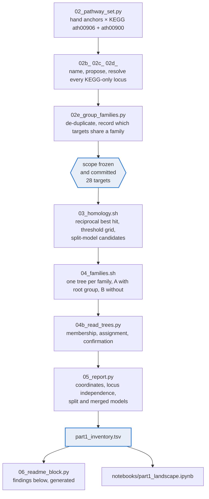

# Carotenoid pathway genes in taro (*Colocasia esculenta*)

A gene inventory of the carotenoid biosynthesis pathway in taro, built so that
every number in it says what kind of evidence it rests on.

The work supports a biofortification question: how many copies of each pathway
gene does taro carry, and which steps are present at all. A cleavage enzyme in
extra copies is a candidate sink for the product a biofortification programme
is trying to accumulate, and the dose of a pathway enzyme depends on how many
loci encode it, so "how many" has to mean something precise.

**Status.** Part 1 complete. Part 2 planned, no data downloaded.

---

## The rule everything here follows

> **Copy number = family assignment (phylogeny) + independent genomic locus
> (coordinates). Presence = reciprocal homology with adequate coverage.
> A detection count is not a copy number.**

Each clause does separate work, and the repository is arranged so that the
three can be told apart in any table or figure.

A **reciprocal best hit** says a taro gene's closest Arabidopsis relative lies
inside a declared family. That is a statement about a pairwise search, not
about a clade, and it is a *lower bound*: a paralog divergent enough that its
closest relative falls outside the family never appears at all.

A **tree** says whether the gene falls inside the clade the family's
Arabidopsis members define. That is family assignment.

**Coordinates** are needed because two sequences assigned to one family can
still be one gene counted twice, either as one gene broken across two
annotation records or, in an assembly reported at 1.83% heterozygosity, as two
haplotigs of the same locus. Both cases occur in this data.

Every target was assigned its claim kind — copy-number, detection or presence —
and the scope was frozen in a committed file, **before** taro was searched. The
point is to stop the evidence standard being set by which findings turn out to
be interesting.

---

## Pipeline



`03_` establishes detection. `04b_` establishes family assignment. `05_`
establishes the locus. No step claims what an earlier one has not supplied.

---

## Reproducing

```bash
source envs/activate.sh

bash   scripts/01_inputs.sh            # verify the 17 proteomes, fetch what is missing

python scripts/02_pathway_set.py       # anchors, KEGG cross-check
python scripts/02b_annotate_kegg.py    # name every KEGG-only locus
python scripts/02c_propose_scope.py    # propose a decision and a reason
python scripts/02d_finalise_scope.py   # resolve the remainder, freeze
python scripts/02e_group_families.py   # de-duplicate, record family groups

bash   scripts/03_preflight.sh         # schema and input agreement
bash   scripts/03_homology.sh          # candidates, grid, split candidates
bash   scripts/04_families.sh          # trees  (~30 min)
python scripts/04b_read_trees.py       # read them
python scripts/05_report.py            # coordinates, master table
python scripts/06_readme_block.py      # regenerate the findings below
```

Heavy files live outside the repository, under the `store` symlink. Nothing in
`results/figures/` is committed; the notebook displays and saves nothing.

---

## Layout

| path | what is in it |
|---|---|
| `scripts/` | the pipeline, numbered in run order. `scripts/README.md` says what each writes |
| `scripts/archive/` | every superseded script, with a table of what replaced it and why |
| `docs/METHODS_part1.md` | the method, including where it cannot establish something |
| `docs/data_sources.md` | the seventeen proteomes, the taro assembly, the pathway definition |
| `docs/proteome_manifest.tsv` | accession, build, annotation source and sequence checksum per proteome |
| `docs/open_questions.md` | what Part 1 raised and did not answer, and the claims withdrawn |
| `docs/ANALYSIS_PLAN_part2.md` | Part 2, pre-registered, written before any Part 2 data |
| `results/tables/` | every table, plus a `log_*.txt` of each step's full output |
| `notebooks/` | figures, display only |
| `LOGBOOK.md` | the running record, including every correction and what it broke |
| `store` | symlink to the heavy data, gitignored |

**`results/tables/part1_inventory.tsv` is the master table.** One row per
target and gene, carrying the homology evidence, the phylogenetic assignment
with its support, the genomic locus, and one `evidence` column stating what
that row establishes.

---

## Reading the record

`LOGBOOK.md` is not a changelog. It records what each correction broke and how
it was caught, because several results changed as a consequence and a reader
checking this work needs to see which.

Three examples of the kind of thing in it. Coverage was computed as alignment
length over query length, which counts gap columns and therefore exceeded 100%;
the correction moved one CCD4 gene across the default cutoff. A rooted
operation was applied to an unrooted tree, which assigned six NCED genes to the
CCD1 group. "No annotated gene between them" was used as evidence for a split
gene model in a genome whose mean gene spacing is 82 kb, which merged two
distinct CCD4 loci into one.

---

<!-- BEGIN part1-findings -->
## Part 1 findings

Generated from `results/tables/part1_inventory.tsv` by
`scripts/06_readme_block.py`. Do not edit by hand.

28 targets: 4 copy-number, 21 detection, 3 presence. 51 target-and-gene rows.

A copy number is reported only where a family assignment clearing SH-aLRT ≥ 80
and UFBoot ≥ 95 meets an independent locus on one of the fourteen anchored
sequences. A detection count is a lower bound, not a copy number.

### Copy-number targets

| target | copies verified | genes | basis |
|---|---|---|---|
| GGPPS family | **0** | — | see note below |
| PSY family | **1** | Ces24605 | tree A/B agree, UFBoot 100.0, 1 anchored sequence(s) |
| CCD4 family | **3** | Ces03723 Ces13250 Ces13251 | tree A/B agree, UFBoot 99.0, 2 anchored sequence(s) |
| NCED family | **0** | — | see note below |

Genes in a copy-number family that do not contribute a verified copy:

| target | gene | sequence | evidence |
|---|---|---|---|
| GGPPS family | Ces14428 | Superscaffold8 | family assigned; gene model length anomalous, copy number not called |
| PSY family | Ces12496 | Superscaffold7 | no tree; locus evidence only |
| PSY family | Ces12497 | Superscaffold7 | no tree; locus evidence only |
| CCD4 family | Ces05879 | Superscaffold3 | no tree; locus evidence only |
| NCED family | Ces09230 | Superscaffold5 | locus verified, family support below threshold |
| NCED family | Ces10063 | Superscaffold6 | locus verified, family support below threshold |
| NCED family | Ces11733 | Superscaffold6 | locus verified, family support below threshold |
| NCED family | Ces16312 | Superscaffold9 | locus verified, family support below threshold |
| NCED family | Ces27429 | unanchor111 | family assigned; unanchored sequence |
| NCED family | Ces28200 | unanchor125 | family assigned; unanchored sequence |

### Family membership, from the root-group split

| job | root group | SH-aLRT | UFBoot | taro tips placed |
|---|---|---|---|---|
| CCD | monophyletic | 97.5 | 100.0 | 10 |
| GGPPS family | monophyletic | 100.0 | 100.0 | 1 |
| PSY family | monophyletic | 100.0 | 100.0 | 1 |

### Detection targets

Lower bounds on family size. Reciprocal best hit cannot see a paralog
whose closest Arabidopsis relative lies outside the declared family.

| pathway | target | counted | independent loci | below the floor |
|---|---|---|---|---|
| MEP | DXS family | 4 | 4 | 6 |
| MEP | DXR family | 1 | 1 | — |
| MEP | MCT family | 1 | 1 | — |
| MEP | CMK family | 1 | 1 | — |
| MEP | MDS family | 1 | 1 | — |
| MEP | HDS family | 1 | 1 | — |
| MEP | HDR family | 2 | 2 | — |
| MEP | IDI family | 1 | 1 | — |
| core | PDS family | 1 | 1 | — |
| core | Z-ISO family | 1 | 1 | — |
| core | ZDS family | 1 | 1 | 1 |
| core | CRTISO family | 1 | 1 | — |
| cyclase | LCYB family | 1 | 1 | — |
| cyclase | LCYE family | 1 | 1 | — |
| xanth | CYP97A family | 1 | 1 | — |
| xanth | CYP97C family | 1 | 1 | — |
| xanth | BCH family | 1 | 1 | 1 |
| xanth | ZEP family | 1 | 1 | 1 |
| xanth | VDE family | 1 | 1 | — |
| xanth | NSX family | 1 | 1 | — |
| degrade | CCD1 family | 1 | 1 | — |

### Presence targets

- **ORANGE**: present — `Ces06664` on Superscaffold4
- **ORANGE-like**: present — `Ces26954` on Superscaffold14
- **fibrillin**: present — `Ces17304` on Superscaffold9

### Annotation anomalies

One gene across two records. Called only on non-overlapping collinear
anchor coverage plus same strand and no annotated gene between; genomic
distance is not used, because mean gene spacing here is 82 kb.

| target | genes | sequence | anchor residues | combined span |
|---|---|---|---|---|
| DXS family | `Ces02306` + `Ces02307` | Superscaffold2 | 482-577 and 585-686 | 11,451 bp |
| DXS family | `Ces02308` + `Ces02309` | Superscaffold2 | 64-206 and 482-716 | 6,680 bp |
| PSY family | `Ces12496` + `Ces12497` | Superscaffold7 | 126-238 and 281-427 | 3,883 bp |

One record spanning more than one gene, or a long lineage-specific
extension. Copy number withheld either way.

| target | gene | protein | span | exons | sequence |
|---|---|---|---|---|---|
| GGPPS family | `Ces14428` | 2232 aa | 13,255 bp | 11 | Superscaffold8 |

<!-- END part1-findings -->
